# 🎨 Arcobaleno Studio

Generador de paletas de colores interactivo desarrollado como Proyecto Integrador del Módulo 1.

---

# 📌 Descripción

Arcobaleno Studio es una aplicación web que permite generar paletas de colores aleatorias de forma rápida e interactiva. El usuario puede seleccionar la cantidad de colores que desea visualizar, bloquear colores específicos para conservarlos en futuras generaciones y copiar fácilmente los códigos HEX de cada color.

---

# ✨ Funcionalidades

* Generación de paletas de colores aleatorias.
* Selección de cantidad de colores (6, 8 o 9).
* Visualización de códigos HEX y HSL.
* Copia del código HEX con un clic.
* Bloqueo y desbloqueo de colores individuales.
* Cambio entre tema claro y oscuro.
* Diseño responsive adaptable a diferentes tamaños de pantalla.

---

# 🖼️ Capturas de la aplicación

## Tema claro

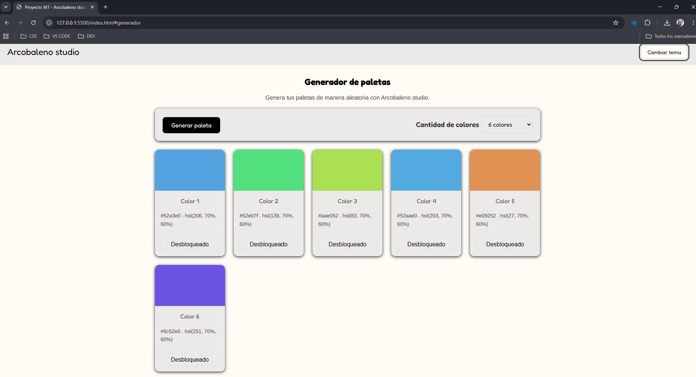

## Tema oscuro

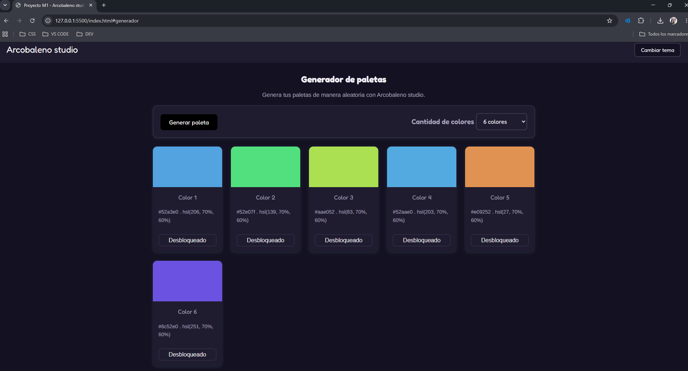


# 🎥 Flujo principal de la aplicación


* Ingreso a la aplicación.
* Cambio de cantidad de colores.
* Generación de una nueva paleta.
* Bloqueo de colores.
* Copia de código HEX.
* Cambio de tema.


# 🛠️ Tecnologías utilizadas

* HTML5
* CSS3
* JavaScript

---

# 🚀 Cómo usar la aplicación

1. Abrir la aplicación desde GitHub Pages o ejecutar el archivo `index.html`.
2. Al ingresar se mostrarán 6 colores por defecto.
3. Seleccionar la cantidad de colores deseada en el desplegable.
4. Presionar el botón **Generar Paleta**.
5. Consultar los códigos HEX y HSL de cada color.
6. Hacer clic sobre el código HEX para copiarlo.
7. Utilizar el botón de bloqueo para conservar colores específicos.
8. Cambiar entre tema claro y oscuro usando el botón correspondiente.

---

# ⚙️ Decisiones técnicas

## Generación de colores

Los colores se generan utilizando el modelo HSL.

* El tono (H) se genera aleatoriamente entre 0 y 360.
* La saturación permanece fija en 70%.
* La luminosidad permanece fija en 60%.

Esta decisión permite obtener colores visualmente equilibrados y agradables.

## Conversión HSL a HEX

Se implementó la función `hslToHex()` para mostrar cada color tanto en formato HSL como en formato HEX.

## Creación dinámica de tarjetas

Las tarjetas de colores se generan dinámicamente mediante JavaScript utilizando `document.createElement()`.

Esto evita escribir manualmente cada tarjeta en el HTML y facilita la escalabilidad de la aplicación.

## Variables CSS

Los colores y estilos principales fueron definidos mediante variables CSS para facilitar el mantenimiento y la reutilización del código.

---

# 📁 Estructura del proyecto

```text
PROYECTOM1_VALENTINALEYVA
│
├── index.html
│
├── CSS/
│   └── styles.css
│
├── JS/
│   └── index.js
│
├── capturas/
│   ├── tema-oscuro.png
│   ├── tema-claro.png
│   └── bloqueo-color.png
│
├── gifs/
    ├── Bloqueo-gif.gif
    ├── copiar-gif.gif
│   └── demo.gif
│
└── IA/
│    ├── prompt-bloqueo.png
│    ├── bloque-1.png
│    ├── bloque-2.png
│    ├── bloque-3.png
│    ├── bloque-4.png
│    ├── bloque-5.png
│    ├── prompt-copiar-hex.png
│    ├── copiar-1.png
│    ├── copiar-2.png 
│    └── copiar-3.png
│
└── README.md

```

---

# 💻 Instalación y ejecución

## Clonar el repositorio

```bash
git clone https://github.com/ValentinaLeyvaCR/ProyectoM1_ValentinaLeyva.git
```

## Ingresar al proyecto

```bash
cd ProyectoM1_ValentinaLeyva
```

## Ejecutar

Abrir el archivo `index.html` en cualquier navegador web moderno.

---

# 🌐 Despliegue

La aplicación puede visualizarse mediante GitHub Pages.

Agregar aquí el enlace publicado:

```text
https://valentinaleyvacr.github.io/ProyectoM1_ValentinaLeyva/
```

---

# 🤖 Uso de Inteligencia Artificial

## 1. Bloqueo y desbloqueo de colores

### Prompt utilizado

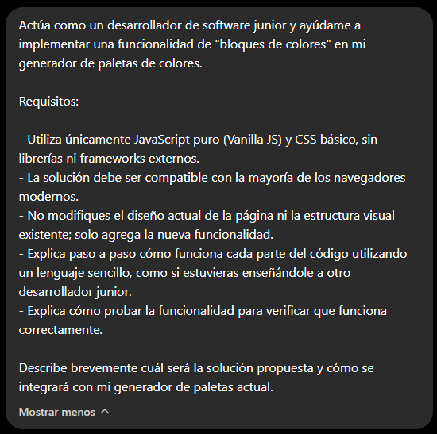

### Resultado obtenido

Se implementó la funcionalidad para bloquear colores individuales de la paleta.

### Explicación sencilla

* Cada tarjeta tiene un botón.
* Al bloquear un color, este permanece igual.
* Los colores desbloqueados sí cambian al generar una nueva paleta.

### Evidencia

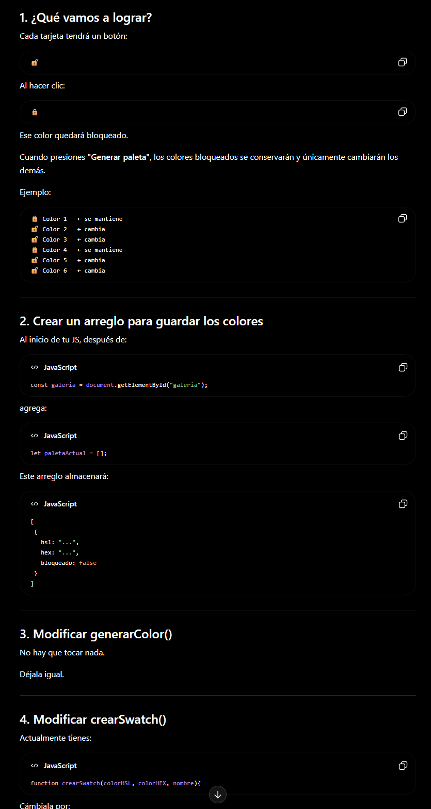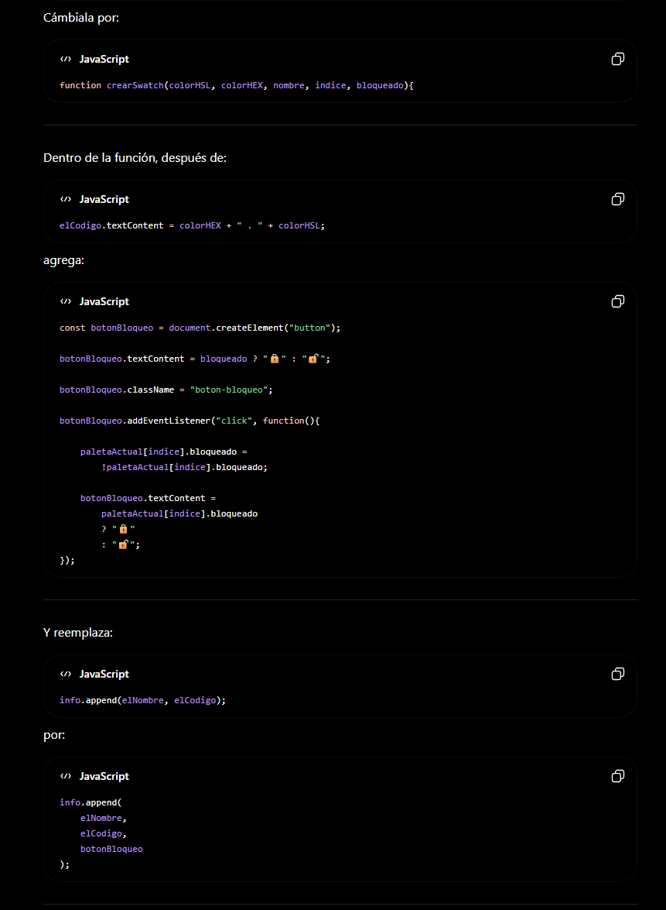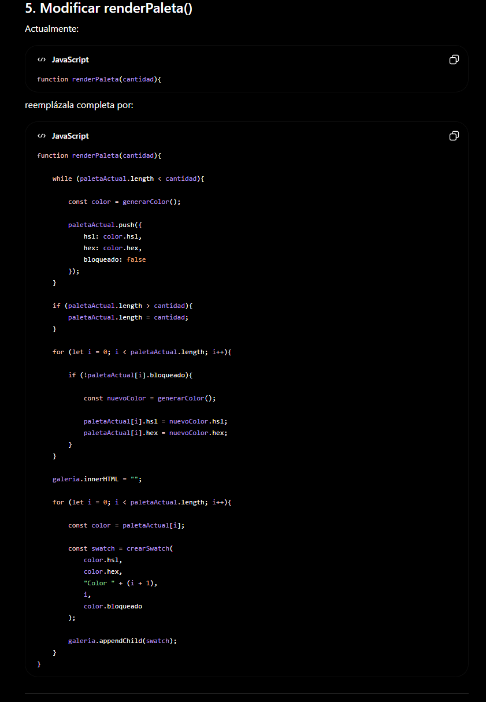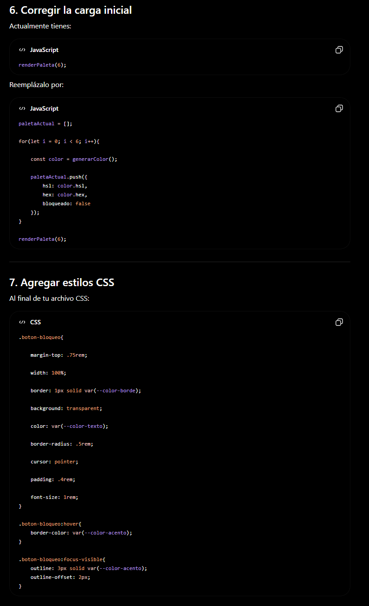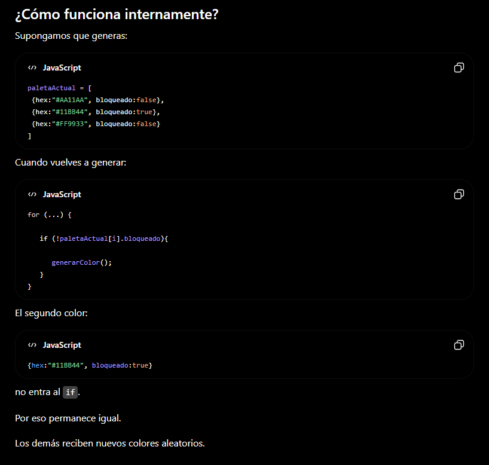 


## 2. Copiar código HEX

### Prompt utilizado

Agregar captura del prompt utilizado.

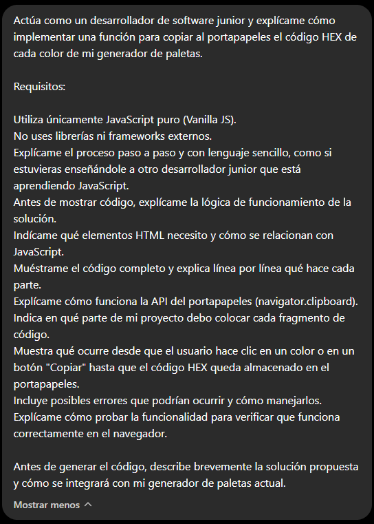

### Resultado obtenido

Se implementó la copia automática de códigos HEX al portapapeles.

### Explicación sencilla

* El usuario hace clic sobre un código HEX.
* El código se copia automáticamente.
* Se muestra un mensaje de confirmación.

### Evidencia

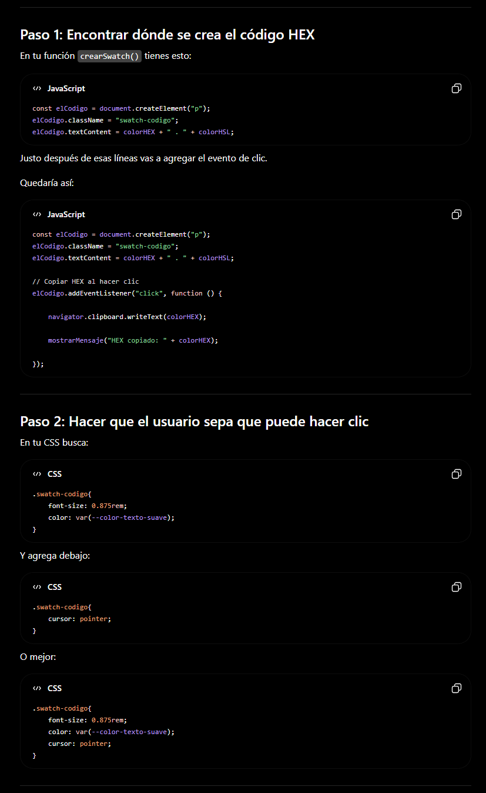 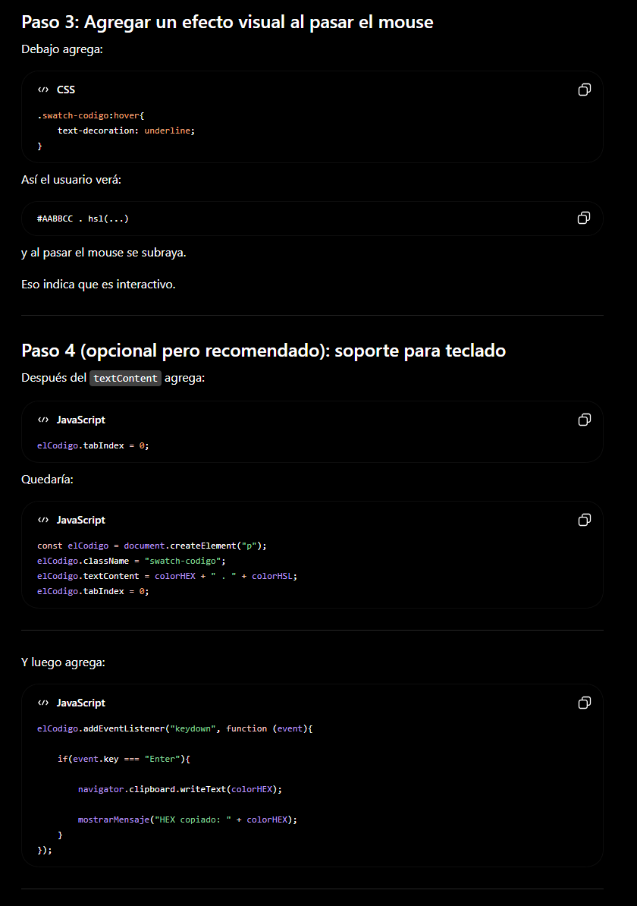 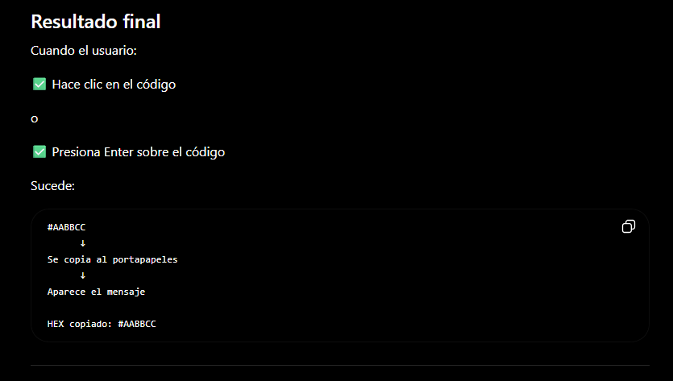


